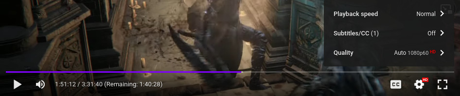
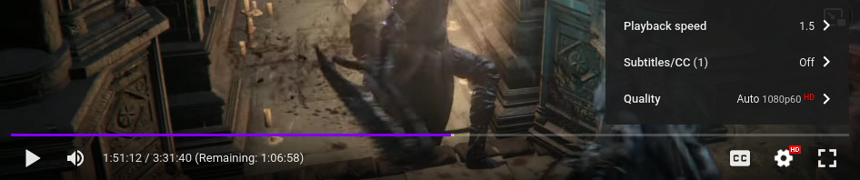

# YouTube Remaining Time

On mobile, YouTube can toggle between the total time of the video and time remaining for the video. I brought this feature to the browser with the addition that if you watch a video in a different speed, it will show you the time remaining if you keep that speed.

## Requirements

- Firefox 48.0 or higher

## Installation

Head over to https://github.com/TrojanerHD/youtube-remaining-time/releases and click on the .xpi file of the newest release. There should be a popup asking whether you allow the addon to be installed. Click “Add”.

## Gallery

Normal speed:

1.5x speed:

## Development

### Prerequesites

- TypeScript
- Git
- Editor/IDE

### Compiling

Run `tsc -p .` in the root directory of this project

## Limitations / Additional Notes

- This plugin will not update automatically. If it does not work for you, check the [releases](https://github.com/TrojanerHD/youtube-remaining-time/releases) page to check if there is a new version
- I do not guarantee to update this addon
- Currently, this plugin only works for the domain `youtube.com`. Other countries's domains (like `youtube.de`) are not supported. If you want your country's domain added, please open an [issue](https://github.com/TrojanerHD/youtube-remaining-time/issues/new)
- This plugin is only localized in English. If you run YouTube in a different language, all text from the plugin will still be English

However, feel free to open [issues](https://github.com/TrojanerHD/youtube-remaining-time/issues/new) if the extension does not work for you (make sure you have the newest version installed before reporting an issue) or if you have a suggestion
